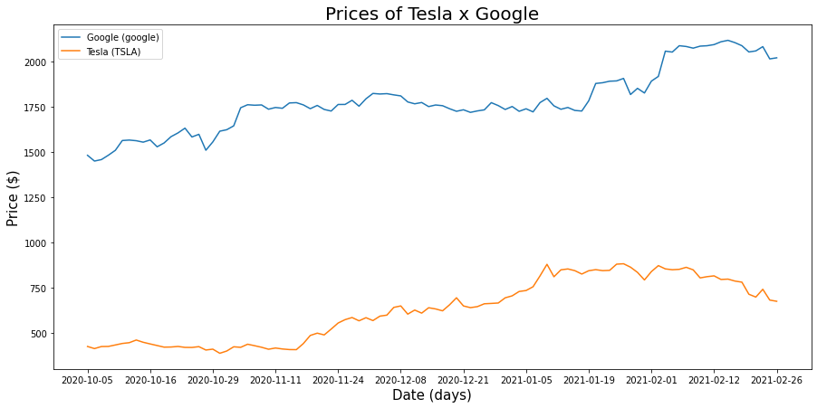

# Merton's Portfolio Problem
In this notebook we try to determine how to _optimally_ distribute your capital over 2 equity stocks and a bond with fix interest rate $r$.
We model Merton's portfolio problem using equity stocks of Google (`GOOGL`) and Tesla (`TSLA`), where we estimate the trends $\mu$ and
volatilities $\sigma$, which we fit to the _Black-Scholes_ model.

In order to measure _investor's_ utility, we used utility function $U(x) = \frac{x^{\gamma}}{\gamma}$. To find an optimal allocation
and maximalize expectation, we used dynamic programming principle and _Hamilton-Jacobi-Bellman_ equation.


Full model and description can be found in [Merton's Portfolio Problem jupyter notebok](./mertons_portfolio_problem.ipynb)

This project was final assignment for the _Intermediate Stochastic analysis_ course at Department of Mathematics and Its 
Applications at Central European University.

## Development
```bash
make requirements
jupyter notebook
```
 
## References
[1] Tikosi, K. (2016), _Merton’s Portfolio Problem_, http://www.etd.ceu.edu/2016/tikosi_kinga.pdf  
[2] Jonsson, M., Sircar, R. (2001) _Optimal Investment Problems and Volatility Homogenization Approximations_, https://www.princeton.edu/~sircar/Public/ARTICLES/montreal.pdf 
[3] Hull, J. (2002). _Options, futures, and other derivatives_ Boston: Prentice Hall  
[4] Hult, H. & Lindskog, F. (2007) _Mathematical Modeling and Statistical Methods for Risk Management_, 
[https://people.kth.se/~lindskog/papers/RMlecturenotes07B.pdf](https://people.kth.se/~lindskog/papers/RMlecturenotes07B.pdf)  
[5] Alpha Vantage, (2017-2021), _Alpha Vantage API Documentation_, https://www.alphavantage.co/documentation/ 